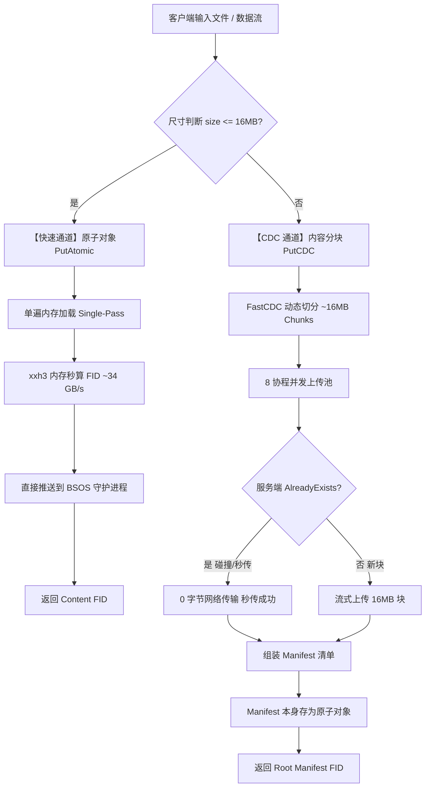

# BSOS 双轨存储架构设计：原子小文件与 CDC 内容分块引擎 (RFC)

> **设计代号**：`CDC-Chunked-Storage-v1`  
> **分支**：`perf/client-io-optimization`  
> **状态**：`Proposed / Approved for Implementation`  
> **目标依赖**：`github.com/PlakarKorp/go-cdc-chunkers`、`github.com/zeebo/xxh3`  
> **编写时间**：2026-09-16  

---

## 1. 架构愿景与双轨模型 (Dual-Path Model)

为了兼顾**海量小文件的极致单遍 I/O 速度**与**大文件的增量去重、秒传及并行吞吐**，BSOS 客户端采用“双轨分治”设计：



---

## 2. 快速通道：原子小/中文件 (`<= 16 MB`)

### 2.1 解决的核心痛点
- 消除当前实现中对磁盘文件的 **Two-Pass 双遍读取**（先读全盘算 Hash，再 Seek(0) 读盘发 gRPC）；
- 对于 `<= 16 MB` 的文件，单遍使用 `os.ReadFile` 读入内存切片，直接调用 AVX2 汇编计算 FID，彻底省去 50% 磁盘 I/O。

### 2.2 契约与行为
- **API**：`c.PutAtomic(ctx, data)` 或 `c.PutFileAtomic(ctx, path)`；
- **硬限制**：若输入尺寸 `> 16 MB`，立即返回 `ErrPayloadTooLarge`（“payload exceeds atomic 16MB threshold, use PutCDC instead”），绝不静默退化。

---

## 3. 大文件通道：FastCDC 动态内容切块 (`> 16 MB`)

### 3.1 核心算法与参数设定
使用 `github.com/PlakarKorp/go-cdc-chunkers` 实现 FastCDC 内容定义分块，免疫插入/删除引起的“边界偏移（Boundary Shift）”问题：

| 参数项 | 设定值 | 理由 |
|---|---|---|
| **Min Size** | `4 MiB` | 避免切出过多微小碎片，保持 NVMe I/O 效率 |
| **Target Size** | `16 MiB` | 吻合 CPU L3 缓存与网络并发吞吐最佳甜蜜点 |
| **Max Size** | `32 MiB` | 严格受控于服务端 `max_put` (256MB) 之下 |
| **Hash 算法** | `xxh3_64` | 每个分块独立生成 `ChunkFID = xxh3_64(chunkData)` |

### 3.2 增量去重与秒传机制
- 对切出的每一个分块，调用带有幂等重传特性的 `PutWithJumpRetry`；
- **若分块已在 BSOS 中存在**：服务端在 `gate` 层返回 `"fid already registered"`，客户端 0 毫秒识别并跳过该分块数据传输（**零网络带宽消耗秒传**）；
- **若分块为新增修改**：通过 Worker 协程流式写入 NVMe 大容量层。

---

## 4. 清单架构 (Manifest Specification)

清单（Manifest）记录大文件的元数据与拓扑结构。**清单本身作为普通原子对象（`<= 16MB`）存储在 BSOS 中**。

### 4.1 二进制 / Protobuf 清单格式
```protobuf
syntax = "proto3";
package bsospb;

message FileManifest {
    uint32 version = 1;          // 协议版本 (当前为 1)
    uint64 total_size = 2;       // 原始大文件总字节数
    uint64 full_content_hash = 3;// 原始文件的完整 xxh3_64 (用于最终完整性校验)
    string filename = 4;         // 可选：原始文件名 / MIME
    repeated ChunkInfo chunks = 5;
}

message ChunkInfo {
    uint64 fid = 1;              // 分块的逻辑 FID (xxh3_64)
    uint64 offset = 2;           // 在原文件中的起始字节偏移
    uint64 size = 3;             // 该分块的字节长度
}
```

### 4.2 清单自包含句柄
- 组装完成的 `FileManifest` 经 Protobuf 序列化后（通常仅几百字节到几 KB），通过 `PutAtomic` 写入 BSOS；
- 存储返回的 `ManifestFID` 即为该大文件的**全局唯一根句柄（Root FID）**。

---

## 5. 读取与拼装引擎 (`GetCDC`)

### 5.1 全量流式拼装读取
1. 客户端传入 `ManifestFID`，首先读取并反序列化 `FileManifest`；
2. 开启后台 Prefetch 队列（预取 2~4 个分块）；
3. 按照 `chunks` 列表顺序并发抓取分块，并平滑流式输出至目标 `io.Writer`。

### 5.2 极速稀疏范围读取 (Sparse Range Read)
当用户请求大文件的局部区间 `[Start, End)` 时：
1. 客户端解析 Manifest，通过二分查找快速命中涉及的特定 Chunk 子集；
2. **只下载落入该区间的 1~2 个 16MB 分块**，其余无关的几十 GB 分块完全不产生网络与磁盘读取。

---

## 6. CLI 用户体验规范

### 6.1 自动智能路由 (`bsos put`)
```bash
# 小于等于 16MB 文件：自动走原子直传
$ bsos put avatar.png
0x715e1e961e1e0537

# 大于 16MB 文件：自动开启 CDC 分块与并发上传
$ bsos put ubuntu-24.04.iso
[CDC] File size: 1.48 GiB -> FastCDC (target 16MiB)
[CDC] Generated 95 chunks. Uploading with 8 workers...
[CDC] Progress: [====================================] 95/95 (92 deduplicated, 3 uploaded)
[CDC] Manifest FID: 0x9e1e5517731ec109
0x9e1e5517731ec109
```

### 6.2 显式模式选项
- `bsos put --atomic <file>`：强制原子模式，超过 16MB 直接退出报错；
- `bsos put --cdc [--workers 8] [--min 4M] [--target 16M] <file>`：强制走 CDC 切块；
- `bsos get <fid>`：自动检测目标是普通对象还是 Manifest，透明解码流式输出。

---

## 7. 实施里程碑 (Implementation Milestones)

- [ ] **M1**: 引入 `github.com/PlakarKorp/go-cdc-chunkers` 并编写 FastCDC 切块器封装；
- [ ] **M2**: 实现 `FileManifest` Protobuf 结构定义与序列化/反序列化；
- [ ] **M3**: 实现 `PutAtomic`（单遍内存直传）与 `PutCDC`（并发多协程上传与清单提交）；
- [ ] **M4**: 实现 `GetCDC`（流式并发预取与精准 Range 裁剪）；
- [ ] **M5**: 编写端对端增量去重压测（修改大文件 10KB，验证秒传率 >95%）。
