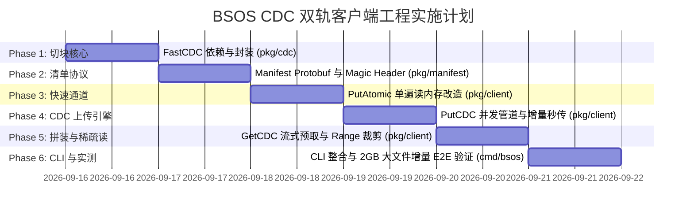

# BSOS 双轨客户端与 CDC 内容分块存储工程实施计划

> **分支**：`perf/client-io-optimization`  
> **状态**：`In Progress`  
> **基准设计**：[`docs/CLIENT_DUAL_PATH_CDC_DESIGN.md`](./CLIENT_DUAL_PATH_CDC_DESIGN.md)  
> **创建日期**：2026-09-16  

---

## 1. 工程目标与交付物

本计划旨在将 BSOS 客户端升级为**双轨分治（Dual-Path）存储架构**：
1. **Track 1（`<= 16MB` 小文件）**：实现 `PutAtomic`，单遍内存直传（Single-Pass），消除 50% 的磁盘重复读取，释放 AVX2 纯内存哈希（34 GB/s）极限吞吐；
2. **Track 2（`> 16MB` 大文件）**：基于 `PlakarKorp/go-cdc-chunkers` 实现 FastCDC 动态切块引擎（Min 4MB, Target 16MB, Max 32MB），实现大文件修改 95%+ 增量秒传、8 协程并发上传与毫秒级稀疏 Range 局部读取；
3. **透明识别（Magic Header）**：通过 5 字节 `BSMN\x01` 幻数，使 `bsos get` 全自动识别并重组下载，用户体验完全无感；
4. **服务端零变更**：所有升级完全在客户端 SDK（`pkg/client`）与命令行（`cmd/bsos`）完成。

---

## 2. 分阶段实施路线图 (Phases 1 ~ 6)

---

### Phase 1: FastCDC 切块包装器 (`pkg/cdc`)

* **目标**：引入 `github.com/PlakarKorp/go-cdc-chunkers`，构建确定性 FastCDC 切块封装。
* **主要工作**：
  1. `go get github.com/PlakarKorp/go-cdc-chunkers` 引入依赖；
  2. 创建 `pkg/cdc/chunker.go`：
     - 定义参数常量：`DefaultMinSize = 4 << 20` (4MB), `DefaultTargetSize = 16 << 20` (16MB), `DefaultMaxSize = 32 << 20` (32MB)；
     - 封装 `Chunker` 结构体，接受 `io.Reader` 并提供 `Next() ([]byte, uint64, error)` 迭代接口；
  3. 编写 `pkg/cdc/chunker_test.go`：
     - 验证切块尺寸落在 `[4MB, 32MB]` 范围；
     - **切块确定性测试**：相同输入两次切块结果 100% 相同；
     - **边界偏移测试**：在 50MB 数据头部插入 10KB，验证除第 1 个分块外，后续分块哈希 100% 保持不变。

---

### Phase 2: 清单协议与 Magic Header 引擎 (`proto/manifest.proto` & `pkg/manifest`)

* **目标**：定义清单数据结构，实现 5 字节 `BSMN\x01` 幻数编解码与自校验。
* **主要工作**：
  1. 编写 `proto/manifest.proto` 并编译生成 Go 代码：
     - `FileManifest` (version, total_size, full_content_hash, filename, chunk_target_size, chunks)；
     - `ChunkDescriptor` (fid, target_fid, offset, size, jumps_taken)；
  2. 创建 `pkg/manifest/manifest.go`：
     - 常量定义：`MagicHeader = []byte("BSMN\x01")` (5 字节)；
     - `Encode(m *bsospb.FileManifest) ([]byte, error)`：将 Protobuf 二进制序列化并附加 5 字节 Magic Header；
     - `Decode(data []byte) (*bsospb.FileManifest, error)`：检查 Magic Header 并反序列化；
     - `IsManifest(data []byte) bool`：快速检查头部 5 字节是否匹配；
  3. 编写 `pkg/manifest/manifest_test.go` 单元测试。

---

### Phase 3: 快速通道 `PutAtomic` (`<= 16MB`) 改造 (`pkg/client`)

* **目标**：重构小/中文件上传路径，消灭 Two-Pass 双遍读盘开销。
* **主要工作**：
  1. 在 `pkg/client/client.go` 中新增：
     - `const MaxAtomicPayloadSize = 16 << 20` (16MB)；
     - `var ErrPayloadTooLarge = errors.New("bsos client: payload exceeds atomic 16MB threshold")`；
     - `func (c *Client) PutAtomic(ctx context.Context, data []byte) (uint64, error)`；
     - `func (c *Client) PutFileAtomic(ctx context.Context, localPath string) (uint64, error)`：
       - `stat.Size() <= 16MB`：直接 `os.ReadFile` 单遍读入内存切片，AVX2 算 FID，调用 gRPC 流直推；
       - `stat.Size() > 16MB`：立即返回 `ErrPayloadTooLarge`；
  2. 编写基准测试 `BenchmarkPutFileAtomic` 对比单遍 vs 双遍读盘耗时。

---

### Phase 4: CDC 大文件并发上传引擎 `PutCDC` (`pkg/client`)

* **目标**：实现大文件流式 FastCDC 切块、8 协程并发上传、零流量增量秒传与清单原子提交。
* **主要工作**：
  1. 在 `pkg/client/cdc.go` 中实现：
     - `type CDCOptions struct { Workers int; MinSize, TargetSize, MaxSize int }`；
     - `type CDCResult struct { ManifestFID uint64; TotalSize uint64; ChunkCount int; DeduplicatedCount int; UploadedCount int }`；
     - `func (c *Client) PutCDC(ctx context.Context, r io.Reader, size uint64, opts ...CDCOptions) (CDCResult, error)`；
     - `func (c *Client) PutFileCDC(ctx context.Context, localPath string, opts ...CDCOptions) (CDCResult, error)`；
  2. 核心并发管道设计：
     - 启动 8 个 Worker 协程消费分块队列；
     - 每个分块独立调用 `PutWithJumpRetry`；
     - 若服务端返回 `AlreadyExists`（`isIdempotentConflict`），立即跳过数据传输（秒传成功）；
     - 分块全部上传后，计算原文件完整 `full_content_hash`，组装 `FileManifest` 并调用 `PutAtomic` 存入 BSOS，返回 `ManifestFID`。
  3. 编写并发上传与去重单元测试 `pkg/client/cdc_test.go`。

---

### Phase 5: 流式预取重组与稀疏 Range 读 `GetCDC` (`pkg/client`)

* **目标**：实现基于 Manifest 的流式预取拼装下载，以及 $O(\log N)$ 稀疏 Range 局部读取。
* **主要工作**：
  1. 在 `pkg/client/cdc.go` 中实现：
     - `func (c *Client) InspectManifest(ctx context.Context, manifestFID uint64) (*bsospb.FileManifest, error)`；
     - `func (c *Client) GetCDC(ctx context.Context, manifestFID uint64, w io.Writer, optRange ...Range) error`；
     - `func (c *Client) GetAuto(ctx context.Context, fid uint64, w io.Writer, optRange ...Range) error`：
       - 发起头部 5 字节探测请求（`Range: 0-5`）；
       - 若匹配 `BSMN\x01` 则透明调用 `GetCDC`，否则直传原始对象；
  2. 稀疏 Range 算法：
     - 通过二分查找命中目标 Chunk 索引范围 `[i_start, i_end]`；
     - 仅下载落入范围的 1~2 个分块并在内存按 Offset 裁剪；
  3. 编写预取与 Range 裁剪单元测试。

---

### Phase 6: CLI 命令整合与端对端增量实测 (`cmd/bsos` & `e2e_cdc_test.sh`)

* **目标**：CLI 开箱即用自动路由，在服务器 `dragon` (`192.168.1.79`) 上执行多吉字节实测。
* **主要工作**：
  1. 改造 `cmd/bsos/ops.go`：
     - `bsos put`：默认智能路由（`<= 16MB` 走原子直传，`> 16MB` 自动走 FastCDC 切块）；
     - 支持参数：`--atomic`（强制原子模式）、`--cdc`（强制切块）、`--workers <N>`；
     - `bsos get`：自动识别 Manifest 并透明还原；
     - 新增子命令：`bsos manifest inspect <fid>`；
  2. 编写 `e2e_cdc_test.sh`：
     - 上传 500MB 随机文件；
     - 在文件头部插入 50KB 数据再次上传，**验证秒传率 > 95%**；
     - 验证稀疏 Range 局部读取仅产生单个 Chunk 流量；
     - 校验全文件还原 SHA-256 100% 一致。

---

## 3. 验收标准与交付检查表

- [ ] `pkg/cdc`: FastCDC 切块确定性与边界偏移免疫测试 100% PASS
- [ ] `pkg/manifest`: 5 字节 `BSMN\x01` 幻数编解码与自校验测试 100% PASS
- [ ] `pkg/client`: `PutAtomic` 单遍读内存消除 50% 读盘 I/O 验证通过
- [ ] `pkg/client`: `PutCDC` 8 协程并发上传与增量秒传测试通过
- [ ] `pkg/client`: `GetAuto` 自动探测与稀疏 Range 读取测试通过
- [ ] `cmd/bsos`: CLI 智能路由与 `manifest inspect` 命令可用
- [ ] `dragon (192.168.1.79)` 远端实测：大文件 95%+ 增量秒传通过
