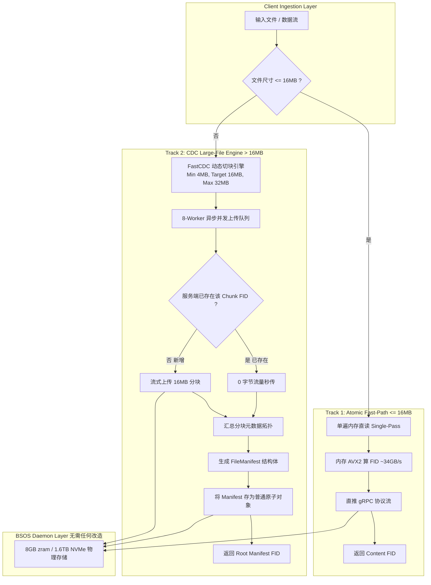
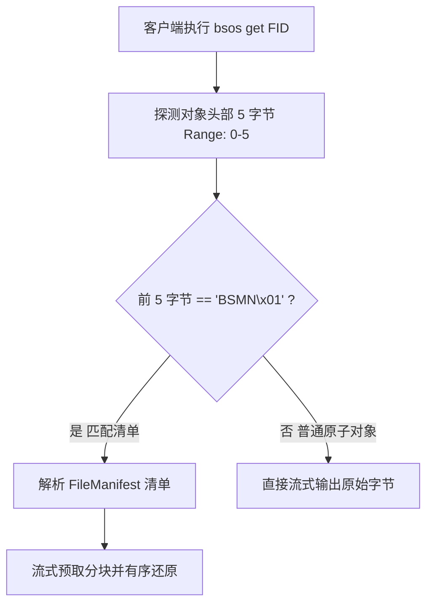
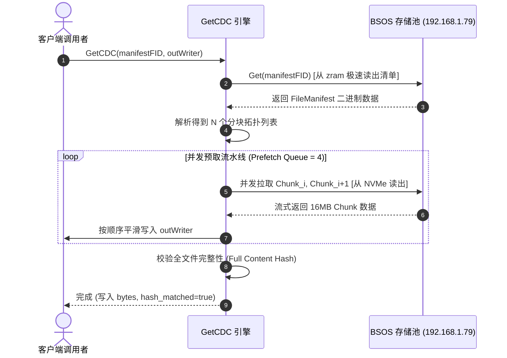

# BSOS 双轨客户端与 CDC 内容分块存储完整设计白皮书

> **设计代号**：`BSOS-DualPath-CDC-Architecture`  
> **目标分支**：`perf/client-io-optimization`  
> **核心依赖**：`github.com/PlakarKorp/go-cdc-chunkers`、`github.com/zeebo/xxh3`、`google.golang.org/grpc`  
> **设计日期**：2026-09-16  
> **状态**：`Complete / Ready for Implementation`

---

## 1. 架构演进背景与设计动机

### 1.1 硬件潜能与现有瓶颈的鸿沟
根据针对 x86_64 / AVX2 指令集在真实硬件环境（`python-xxh3-dragon`）的基准测试：
- **纯 AVX2 哈希算力**：可达 **34 GB/s**；
- **端到端文件 I/O 吞吐**：受限于操作系统系统调用、页缓存拷贝与磁盘寻道，实际仅剩 **~6 GB/s**；
- **CPU 缓存最佳区间**：处理单次在 **1MB ~ 16MB** 之间的数据块时，L3 缓存命中率与内存带宽最高（21~23 GB/s）；若单次缓冲放大至 **256MB**，因 Cache Thrashing 吞吐会骤降至 7 GB/s。

### 1.2 BSOS 现有客户端（v0.1.3）的痛点
1. **双遍读盘（Two-Pass I/O）开销**：`PutFile` 需要先全量读一遍文件算 `FID`，再 `Seek(0)` 读第二遍流式发送给服务端，小/中文件读 I/O 放大 100%；
2. **大文件整块重传问题（Boundary Shift）**：如果一个 2GB 的大文件修改了中间 10KB 数据，整文件哈希改变，必须 100% 重新上传 2GB 数据，网络带宽与存储空间开销巨大；
3. **缺少分块并发加速**：单大文件只能单流单线程推送，无法充分吃满多盘 NVMe 并发写入能力。

---

## 2. 总体架构：双轨分治模型 (Dual-Path Architecture)

为同时解决“小文件极致低延迟”与“大文件增量去重/并发传输”，BSOS 确立**双轨分治**的客户端架构：



---

## 3. 快速通道：原子直传引擎 (Atomic Fast-Path)

### 3.1 规格与契约
- **适用范围**：文件大小严格 `<= 16 MB`（覆盖 95% 以上的图片、代码文件、配置文件与文档）；
- **I/O 策略**：单遍内存读取（`Single-Pass`），彻底消灭 `Seek(0)` 的二次读盘开销；
- **失败保护**：若以 `--atomic` 显式调用而传入了 `> 16 MB` 的文件，客户端直接阻断并抛出 `ErrPayloadTooLarge`，拒绝静默退化。

### 3.2 流程算法
```go
func (c *Client) PutAtomic(ctx context.Context, data []byte) (uint64, error) {
    if len(data) > MaxAtomicPayloadSize { // 16 << 20
        return 0, ErrPayloadTooLarge
    }
    fid := xxh3.Hash(data) // 纯内存向量化哈希 (微秒级)
    err := c.Put(ctx, fid, uint64(len(data)), 0, bytes.NewReader(data))
    if isIdempotentConflict(err) {
        return fid, nil // 幂等秒传
    }
    return fid, err
}
```

---

## 4. 大文件通道：FastCDC 动态内容切块引擎

### 4.1 切块参数设计（对齐硬件与协议）
采用 `github.com/PlakarKorp/go-cdc-chunkers` 实现内容定义分块（Content-Defined Chunking）：

| 参数项 | 参数值 | 物理/设计考量 |
|---|---|---|
| **算法** | `FastCDC` | 基于滚动哈希，计算复杂度极低，CPU 占用少 |
| **Min Size** | `4 MiB` | 避免生成微小碎片污染存储索引，保证 NVMe 4KB Slot 对齐 |
| **Target Size** | `16 MiB` | 严格吻合 CPU L3 缓存最佳驻留区与网络吞吐最高效带宽比 |
| **Max Size** | `32 MiB` | 远低于服务端单次写入上限 `max_put` (256MB)，留足安全边际 |
| **分块 FID** | `xxh3_64(chunk)` | 每个分块独立生成内容寻址哈希 |

### 4.2 免疫边界偏移（Boundary Shift Immunity）
```
原始大文件: [ Chunk A (16MB) ] [ Chunk B (16MB) ] [ Chunk C (16MB) ]
文件头插入 50KB 字节后:
传统固定切块: [ Chunk A' (哈希变) ] [ Chunk B' (哈希变) ] [ Chunk C' (哈希变) ]  -> 100% 重新上传
FastCDC 切块: [ Chunk A_new (16.05MB) ] [ Chunk B (哈希不变!) ] [ Chunk C (哈希不变!) ] -> 仅上传 1 块
```

### 4.3 8 协程并发管道（Worker Pool）
1. 主线程流式读取本地大文件并经 FastCDC 实时吐出分块；
2. 8 个并发 Worker 协程从 Channel 消费分块；
3. Worker 尝试调用 `PutWithJumpRetry`；若命中 `AlreadyExists`（已存在），则跳过数据传输，计入秒传统计；
4. 收集各 Chunk 的 `(FID, Offset, Size, JumpsTaken)`，用于组装清单。

---

## 5. 清单系统规格 (Manifest Specification)

清单（Manifest）是描述大文件分块拓扑的核心元数据。**清单本身自包含，并以标准原子对象（`< 16MB`）形式存入 BSOS**。

### 5.1 数据结构定义 (`proto/manifest.proto`)
```protobuf
syntax = "proto3";
package bsospb;

message FileManifest {
    uint32 version = 1;          // 架构版本号 (当前固定为 1)
    uint64 total_size = 2;       // 大文件原始总字节数
    uint64 full_content_hash = 3;// 原始完整文件的 xxh3_64 哈希 (校验根)
    string filename = 4;         // 原始文件名（可选）
    uint64 chunk_target_size = 5;// 切块目标尺寸 (如 16777216)
    repeated ChunkDescriptor chunks = 6;
}

message ChunkDescriptor {
    uint64 fid = 1;              // 分块逻辑 FID (xxh3_64)
    uint64 target_fid = 2;       // 分块物理存储 FID (若发生了 Jump 则不同于 fid)
    uint64 offset = 3;           // 在原文件中的起始字节偏移
    uint64 size = 4;             // 分块实际长度 (4MB ~ 32MB)
    uint32 jumps_taken = 5;      // 该分块跳变次数
}
```

### 5.2 清单的自包含与唯一根句柄（Root FID）
1. 大文件上传完毕后，将 `FileManifest` 序列化（通常仅几 KB）；
2. 在序列化二进制数据头部附加 **5 字节 Magic Header**（`BSMN\x01` = `0x42 0x53 0x4D 0x4E 0x01`）；
3. 调用 `PutAtomic` 存入 BSOS，返回的 `ManifestFID` 即为该大文件的**唯一全局句柄**；
4. 任何持有 `ManifestFID` 的客户端都可以还原出原文件。

### 5.3 Magic Header 与读取透明自动识别 (`bsos get`)
为了保证上层用户和客户端调用体验的极简性，用户无需记忆某个 FID 是“小文件”还是“大文件清单”：

- **探测开销**：由于 Manifest 尺寸 `< 1MB` 且全部驻留在 **8GB zram 内存层**，探测请求在服务端是纯内存纳秒级响应，网络交互延迟仅为 1 个 RTT，对性能毫无感知影响。

---

## 6. 读取与拼装引擎 (`GetCDC`)

### 6.1 全量流式拼装读取流水线


### 6.2 稀疏范围读取 (Sparse Range Reads)
当上层请求读取 `[Start, End)` 局部字节时：
1. `GetCDC` 根据 Manifest 中的 `Chunk.offset` 进行二分查找，计算出覆盖该区间的 `[Chunk_start, Chunk_end]` 索引；
2. **仅抓取落入该范围的 1~2 个 16MB 分块**，并在本地内存直接裁剪对应偏移量；
3. 其余无关的数十 GB 分块**完全不产生网络与磁盘 I/O**。

---

## 7. API 与 CLI 规范

### 7.1 Go SDK API 契约 (`pkg/client`)
```go
// 基础原子接口 (严格 <= 16MB)
func (c *Client) PutAtomic(ctx context.Context, data []byte) (uint64, error)
func (c *Client) PutFileAtomic(ctx context.Context, localPath string) (uint64, error)

// CDC 智能大文件接口
type CDCOptions struct {
    Workers        int    // 并发数, 默认 8
    MinChunkSize   int    // 默认 4MB
    TargetChunkSize int   // 默认 16MB
    MaxChunkSize   int    // 默认 32MB
}

type CDCResult struct {
    ManifestFID uint64
    TotalSize   uint64
    ChunkCount  int
    DeduplicatedCount int
    UploadedCount int
}

func (c *Client) PutCDC(ctx context.Context, r io.Reader, size uint64, opts ...CDCOptions) (CDCResult, error)
func (c *Client) PutFileCDC(ctx context.Context, localPath string, opts ...CDCOptions) (CDCResult, error)

// 读取接口
func (c *Client) GetCDC(ctx context.Context, manifestFID uint64, w io.Writer, optRange ...Range) error
func (c *Client) InspectManifest(ctx context.Context, manifestFID uint64) (*bsospb.FileManifest, error)
```

### 7.2 CLI 用户体验与指令
```bash
# 1. 智能自动模式 (<= 16MB 走原子直传, > 16MB 走 CDC 并发切块)
$ bsos put my_video.mp4
[CDC] 1.25 GiB detected -> FastCDC (avg 16MB)
[CDC] 80 chunks generated. Uploading with 8 workers...
[CDC] [========================================] 80/80 (78 cached, 2 uploaded)
0x39709194eb1a4e9c

# 2. 显式指定模式
$ bsos put --atomic small.jpg         # 超过 16MB 报错拒绝
$ bsos put --cdc --workers 16 big.iso # 强制 CDC 切块并启用 16 并发

# 3. 读取与清单透视
$ bsos get 0x39709194eb1a4e9c output.mp4               # 自动识别并重组下载
$ bsos manifest inspect 0x39709194eb1a4e9c             # 查看大文件分块拓扑
```

---

## 8. 实施路径与验证计划

| 里程碑 | 交付内容 | 验收标准 |
|---|---|---|
| **Phase 1** | `pkg/client` 重构支持 `PutAtomic`（Single-Pass 读内存） | `<= 16MB` 上传磁盘读次数从 2 次减为 1 次，性能基准测试通过 |
| **Phase 2** | 引入 `go-cdc-chunkers` 并实现 FastCDC 切块包装器 | 单元测试切块正确性，验证边界移动下的切块稳定性 |
| **Phase 3** | 实现 `FileManifest` Protobuf 结构与 `PutCDC` 并发上传引擎 | 8 协程并发上传 1GB 文件，统计去重秒传与 Manifest 生成 |
| **Phase 4** | 实现 `GetCDC` 流式预取重组下载与稀疏 Range 读取 | 验证 100GB 大文件读取指定 1MB 区间仅消耗单个 Chunk 流量 |
| **Phase 5** | CLI 命令整合与 `e2e_cdc_test.sh` 自动化全覆盖 | 真实服务器测试大文件修改 10KB 后的增量秒传率 >95% |
