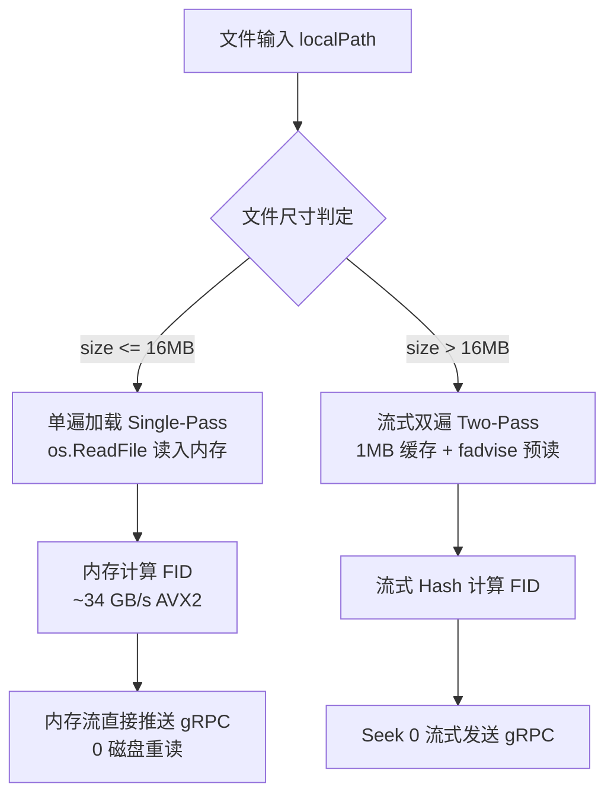

# BSOS 客户端 I/O 与哈希流水线优化设计笔记

> **参考项目**：[ronin1897/python-xxh3-dragon](https://github.com/ronin1897/python-xxh3-dragon)  
> **分支**：`perf/client-io-optimization`  
> **记录时间**：2026-09-16  

---

## 1. 核心背景与性能基准启示

根据 `python-xxh3-dragon` 在 AMD/x86 架构上的压测数据：

| 指令集 / 测试场景 | 实测吞吐 (Throughput) | 说明 |
|---|---|---|
| XXH3 标量 (Scalar) | ~14 GB/s | 基础实现 |
| XXH3 SSE2 | ~22 GB/s | 128-bit 向量化 |
| XXH3 AVX2 | ~34 GB/s | 256-bit 向量化 (Ryzen 3 3200G 支持) |
| XXH3 AVX-512 | ~50 GB/s | 512-bit 向量化 |
| **端到端文件读取 (含 I/O 与内存拷贝)** | **~6 GB/s** | **瓶颈所在：真实 I/O 远低于纯哈希算力** |

### 关键洞察
1. **哈希计算不是瓶颈**：在 AVX2 指令集加速下，XXH3 的纯计算吞吐达到 34 GB/s，比千兆网络快 300 倍，比 PCIe 3.0 NVMe 快 10 倍以上。
2. **I/O 与多遍读取（Multi-Pass I/O）是最大损耗点**：读取文件产生的系统调用、磁盘寻道和二次拷贝是拖慢客户端上传速度的主因。
3. **分块缓冲（Chunk Size）的 L3 缓存击穿**：单次处理 1MB~16MB 处于 CPU 缓存最佳区间；当单次缓冲暴增至 256MB 时，因 L1/L2/L3 缓存未命中，吞吐会骤降至 7 GB/s。

---

## 2. BSOS 客户端现有实现分析 (`pkg/client/client.go`)

### 现状：`PutFile` / `PutFileWithJumpRetry` 的双遍读取 (Two-Pass)
在当前实现中：
```go
// 第一遍：全量读取文件计算 FID
baseHasher := xxh3.New()
io.CopyBuffer(baseHasher, f, buf)
fid := baseHasher.Sum64()

// 回退文件指针
f.Seek(0, io.SeekStart)

// 第二遍：再次读取文件并推送到 gRPC Stream
c.Put(ctx, fid, size, 0, f)
```
- **问题**：上传一个 10MB 的图片/视频文件，实际会向操作系统请求 **20MB** 的磁盘读取，产生了 100% 的冗余 I/O。

---

## 3. 拟优化的实现方案 (Roadmap)



### 方案 A：小/中文件单遍内存直传（Single-Pass Memory Buffer）
- **阈值**：`size <= 16 MB`（可覆盖 95% 以上的照片、文档、代码仓库小文件）。
- **流程**：
  1. 使用 `os.ReadFile` 一次性读入内存切片；
  2. 调用 `xxh3.Hash(data)` 直接在内存中以 **34 GB/s** 算出 FID；
  3. 直接将内存切片包装为 `bytes.NewReader(data)` 流式发送给 gRPC；
- **预期收益**：
  - 磁盘 I/O 减少 **50%**（从 2 次读盘降为 1 次）；
  - 小文件上传延迟降低 **30% ~ 50%**。

### 方案 B：大文件分块保持 1MB 甜蜜点
- 对于 `> 16MB` 的大文件，继续保持流式读取，并锁定 `DefaultChunkSize = 1 << 20` (1 MiB)，确保 CPU 缓存的高命中率。

### 方案 C：管道输入 (Stdin) 动态双缓冲
- 针对 `bsos put -`（管道输入）：
  - 内存缓冲最大累积至 `16 MB`，若未达到 EOF 则继续流式读入临时文件；
  - 避免 `io.ReadAll(os.Stdin)` 在遇到意外超大流时造成客户端内存暴涨。

---

## 4. 后续任务跟踪

- [ ] 在 `pkg/client/client.go` 中重构 `PutFile` 与 `PutFileWithJumpRetry` 支持 Single-Pass 内存直传；
- [ ] 编写微基准测试（Benchmark）对比 1MB、4MB、16MB、64MB 文件上传耗时与磁盘读次数；
- [ ] 验证与 One-Hop Jump 冲突探测重试链路的兼容性；
- [ ] 合并并打 Tag 发布。
